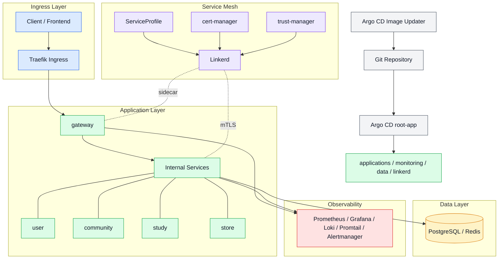

# checkmate-kubernetes

CheckMate의 MSA 백엔드와 플랫폼 인프라를 k3d 기반 Kubernetes 개발 환경에서 GitOps로 관리.


## 구성

- 애플리케이션: `gateway`, `community`, `study`, `user`, `store`
- 플랫폼: Argo CD, Argo Rollouts, Linkerd, cert-manager, trust-manager
- 관측: Prometheus, Grafana, Loki, Promtail, Alertmanager
- 데이터: PostgreSQL, Redis
- 진입점: Traefik Ingress

## 아키텍처 요약



## 서비스별 역할

| 서비스 | 역할 |
| --- | --- |
| `gateway` | 외부 요청 진입점과 내부 API 라우팅 |
| `user` | 사용자, 인증/인가 관련 도메인 |
| `community` | 공지, 문의 등 커뮤니티 도메인 |
| `study` | 스터디 그룹 관련 도메인 |
| `store` | 상품, 배지, 포인트 관련 도메인 |

## 배포 방식

```text
Git
  -> Argo CD root-app
    -> applications/dev 하위 Application 동기화
      -> charts/* + values/dev/* 로 Helm 배포
        -> applications / monitoring / data / linkerd 적용
```

```text
GHCR 새 이미지
  -> Argo CD Image Updater 감지
    -> values/dev/*.yaml 의 image.tag 갱신
      -> Git write-back
        -> Argo CD 재동기화
```

```text
sync wave
  -> cert-manager, trust-manager
  -> linkerd-crds, linkerd-certs
  -> linkerd-control-plane, linkerd-viz
  -> ServiceProfile
  -> 애플리케이션
```

- 서비스 템플릿은 `charts/*`, 환경별 값은 `values/dev/*`에서 관리.
- 일부 서비스는 Argo Rollouts 사용. 카나리 단계는 `20% -> 50% -> 100%`.

## 운영 포인트

- 설정 변경. 주 대상은 `values/dev/*`.
- 새 이미지 배포. Argo CD Image Updater가 `image.tag`를 Git에 반영.
- 배포 리소스. 일부는 `Deployment`, 일부는 `Rollout`.
- 관리 범위. 애플리케이션뿐 아니라 Linkerd, monitoring, data까지 포함.

## Linkerd ServiceProfile

공통 정책.

- retry budget: `ttl 10s`, `minRetriesPerSecond 10`, `retryRatio 0.2`
- 조회성 `GET` 요청. 주로 `retryable=true`, `timeout=1s`
- 변경성 `POST/PATCH/DELETE` 요청. `retryable=false`, `timeout=2s`

적용 경로.

- `community`: `/inquiries`, `/notices`
- `study`: `/study-groups`
- `store`: `/products`, `/badges`, `/points`
- `user`: `/users`, `/auth`

## 모니터링

- 메트릭 수집: Prometheus + kube-prometheus-stack.
- 로그 수집: Loki + Promtail.
- 시각화: Grafana Ingress 제공. Loki, Alertmanager 연동.
- 로그 가공: Promtail pipeline에서 Spring ERROR 로그를 메트릭으로 변환.
- 알림 전송: Alertmanager에서 Discord webhook 사용.
- 기본 알림: Spring ERROR 로그, 노드 CPU 사용률, 서비스 Pod CPU 사용률.
- 기본 대시보드: Loki 에러 로그, Gateway API 트래픽, Gateway access log 요청/응답.

## 트리 구조

```text
.
|-- applications
|   `-- dev
|       |-- root-app.yaml
|       |-- *-app.yaml
|       |-- data
|       |-- linkerd-serviceprofiles
|       `-- monitoring
|-- charts
|   |-- gateway
|   |-- eureka
|   |-- community
|   |-- study
|   |-- user
|   |-- store
|   `-- monitoring
|-- manifests
|   |-- linkerd-crds
|   `-- linkerd-certs
|-- values
|   `-- dev
|-- scripts
|   |-- apply-dev-secrets.sh
|   `-- k6
`-- README.md
```
